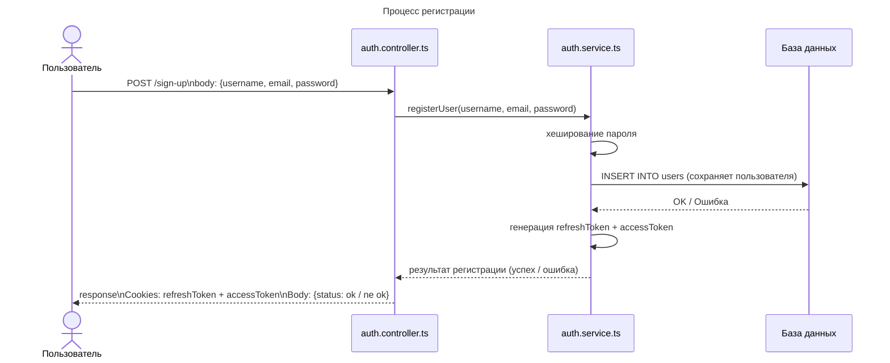
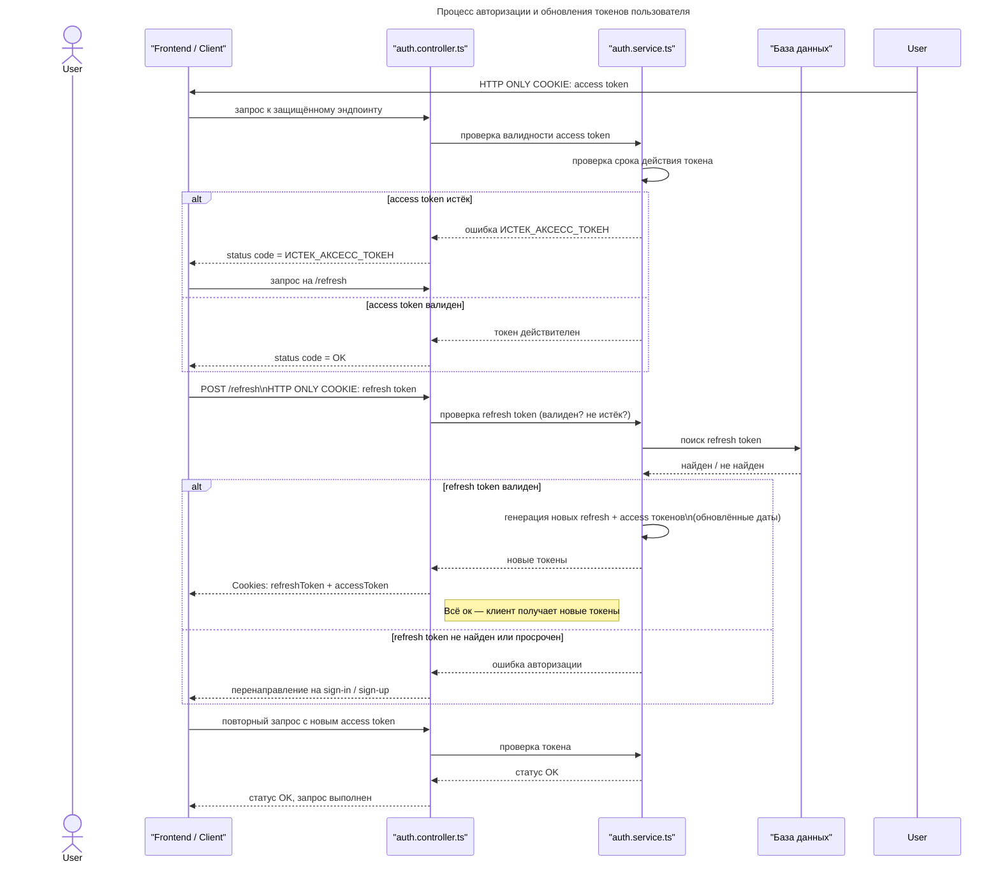
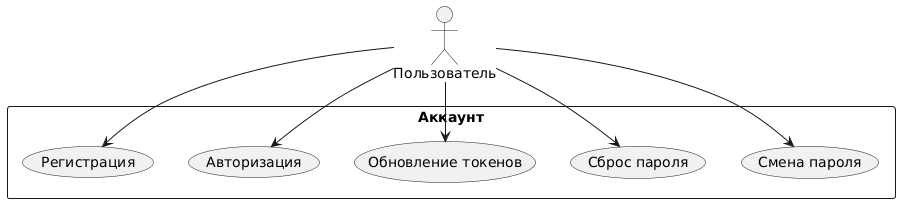
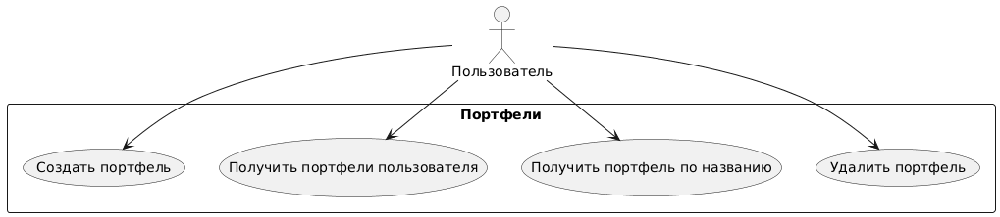
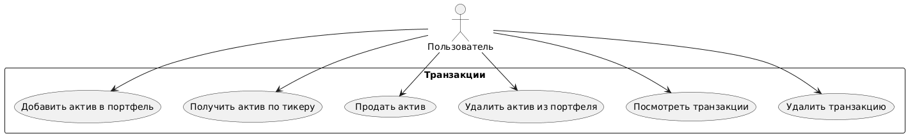
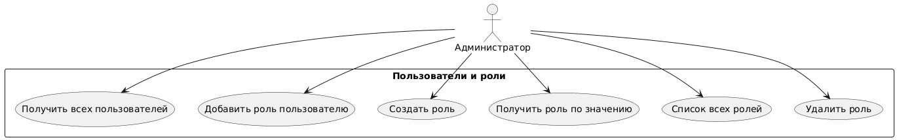
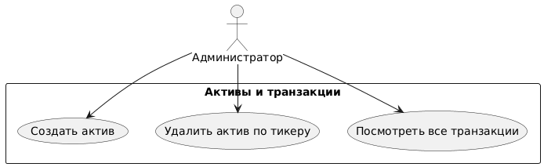
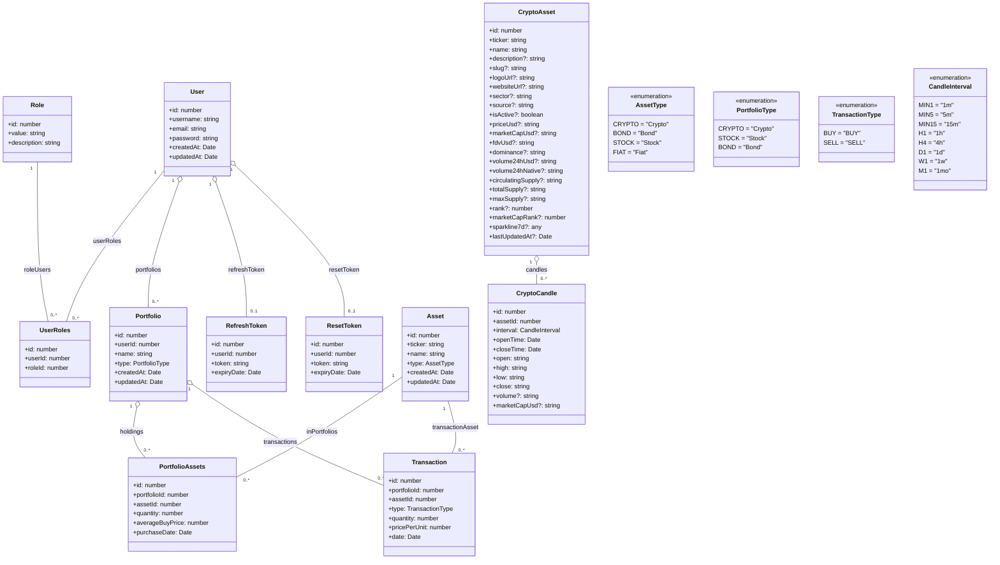

## 📘 Описание UML-диаграмм

Представленные UML-диаграммы описывают ключевые процессы и структуру взаимодействия компонентов системы.

Процесс регистрации — диаграмма последовательности, демонстрирующая шаги, выполняемые при создании нового пользователя: передача данных с клиента, обращение к контроллеру и сервису, хеширование пароля, сохранение записи в базе данных и генерация токенов доступа.

Процесс авторизации и обновления токенов — диаграмма последовательности, показывающая проверку access token при обращении к защищённым эндпоинтам, обработку ситуации с истекшим токеном, генерацию новых refresh и access токенов и повторную проверку авторизации.

Модели и их взаимодействие (User Portfolio System) — диаграмма классов, отражающая структуру данных приложения: пользователей, роли, портфели, активы, транзакции и токены.
В ней указаны первичные и внешние ключи, а также связи между сущностями: один-ко-многим (например, пользователь → портфели) и многие-ко-многим (через таблицы UserRoles и PortfolioAssets).

*Доступные действия пользователя*

Диаграмма отображает все действия, доступные пользователю для управления аккаунтом. Эти действия включают регистрацию, авторизацию, обновление токенов, сброс пароля и изменение пароля. Часть функций доступна публично, но для большинства операций требуется авторизация через JwtAuthGuard.

Диаграмма отображает все действия, доступные пользователю для управления аккаунтом. Эти действия включают регистрацию, авторизацию, обновление токенов, сброс пароля и изменение пароля. Часть функций доступна публично, но для большинства операций требуется авторизация через JwtAuthGuard.

Диаграмма отображает все действия, доступные пользователю для управления аккаунтом. Эти действия включают регистрацию, авторизацию, обновление токенов, сброс пароля и изменение пароля. Часть функций доступна публично, но для большинства операций требуется авторизация через JwtAuthGuard.

Диаграмма показывает действия, доступные администратору для управления пользователями и ролями. Администратор может получать информацию обо всех пользователях, добавлять и удалять роли, а также создавать новые роли и получать их по значению.

Диаграмма показывает действия, доступные администратору для работы с активами и транзакциями. Администратор может создавать активы, удалять их по тикеру, а также просматривать все транзакции. 

Все эти действия также требуют наличия роли ADMIN и проверки прав через JwtAuthGuard и RolesGuard.

Диаграмма показывает структуру данных платформы аналитики портфелей: пользователей и их роли, портфели и состав портфелей (активы с количеством и средней ценой), а также историю транзакций. Типы активов/портфелей/транзакций вынесены в перечисления, чтобы явно фиксировать допустимые значения.