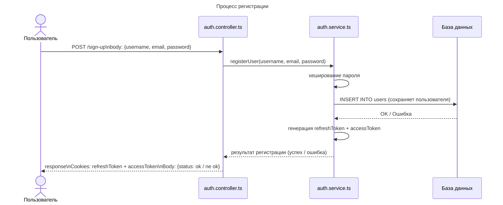
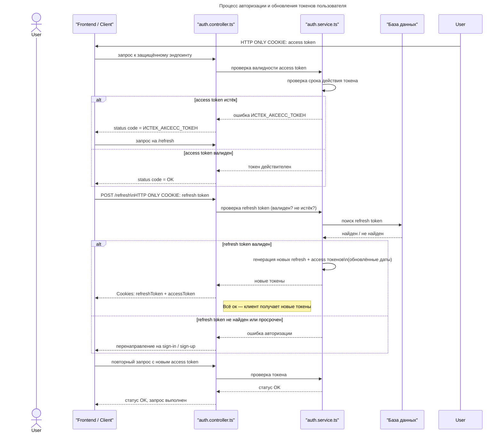

## 📘 Описание UML-диаграмм

Представленные UML-диаграммы описывают ключевые процессы и структуру взаимодействия компонентов системы.

Процесс регистрации — диаграмма последовательности, демонстрирующая шаги, выполняемые при создании нового пользователя: передача данных с клиента, обращение к контроллеру и сервису, хеширование пароля, сохранение записи в базе данных и генерация токенов доступа.

Процесс авторизации и обновления токенов — диаграмма последовательности, показывающая проверку access token при обращении к защищённым эндпоинтам, обработку ситуации с истекшим токеном, генерацию новых refresh и access токенов и повторную проверку авторизации.

Модели и их взаимодействие (User Portfolio System) — диаграмма классов, отражающая структуру данных приложения: пользователей, роли, портфели, активы, транзакции и токены.
В ней указаны первичные и внешние ключи, а также связи между сущностями: один-ко-многим (например, пользователь → портфели) и многие-ко-многим (через таблицы UserRoles и PortfolioAssets).

